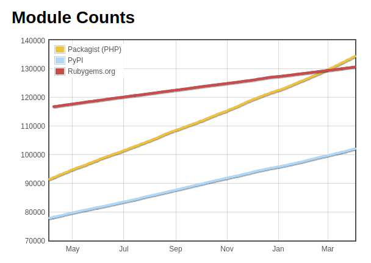

# Open Source Society

## Catherine Devlin

[bit.ly/pyohio2015keynote](http://bit.ly/pyohio2015keynote)

---

# Not the topic 

The society of open source

<!-- Not the traditional talk about how open source works -->

<!-- or how it makes money -->

<!-- what crazy anarchists!  What sorcery? -->

---

# Topic 

Open source impact on society:

- It will change the world.

- Not through software.

---

# I am FOSS

- Accidental programmer & DBA
- `ipython-sql`
- FOSS society fan: PyOhio 2008
- Public employee: 18F 

---

# You are FOSS

- Write code
- Implement
- Popularize
- Document 
- Adapt
- Teach
- Bug reports

---

# Status report 

<!-- I missed Ohio's State of the State address on Tuesday.  -->

---

[Life expectancy doubled since 1900](https://ourworldindata.org/life-expectancy)

Source: [The Economist](http://www.economist.com/blogs/graphicdetail/2012/02/daily-chart-20)

---

# Scale

<!-- Human cooperation enables most of this improvement. -->

<!-- But we're not built to cooperate at this scale. -->

---

## [Dunbar's Number](https://en.wikipedia.org/wiki/Dunbar%27s_number)

### ~150

---

## Technology of cooperation

- Hierarchy
- Regulations
- Marketplace

---

# Hierarchy

> Enlil-bani, wondrous king among the princes!  Created by An, 
elevated by Enlil, like Uti the light of all lands, 
born to princedom, girded with all the divine powers, 
watched over by Enlil and listened to by Ninlil
on account of the widespread people living at the 
boundary of heaven and earth!

<!-- King of Sumeria, ~ 1800 BC -->

---

# Law

- Hammurabi
- Solon
- Numa 
- Alfred
- Hiawatha
- Quetzalcoatl

---

# Marketplace 

<!-- Every public good is in danger of sacrifice -->

---

Governments, Corporations, NGOs, ...

They work, BUT

---

> [O]utside the ordered universe [is] that amorphous blight of nethermost confusion which blasphemes and bubbles at the center of all infinity—the boundless daemon sultan Azathoth, whose name no lips dare speak aloud, and who gnaws hungrily in inconceivable, unlighted chambers beyond time and space amidst the muffled, maddening beating of vile drums and the thin monotonous whine of accursed flutes.

> - H. P. Lovecraft, "The Dream-Quest of Unknown Kadath", in At The Mountains of Madness

---

<!-- We feel that they do not empower human intelligence, but hamstring it -->

---

<!-- -->

<!-- not a foreign occupier -->

<!-- OK, but can we have a more productive revolution? -->

---

# Revolutions

* Agricultural
* Industrial
* Information

---

---

# Changes to 

* More industries
* Society's structure
* Mind

<!-- urbanization -->

<!-- Supernatural: wild, to great cultivator, to a machine -->

---

# Scaling cooperation

<!-- back to the first problem -->

<!-- Cooperative technologies developed with revolutions -->

<!-- Took centuries -->

<!-- Don't know the results, but excited about prospects -->

---

# 130,000 Packages

<!-- Python: 20,000 package contributors-->

<!-- big company -->

<!-- teaching, document, popularize, bug reports -->

<!-- without: hierarchy, law, marketplace -->

---

# Cooperation Lab

- Tools
- Techniques
- Attitudes

---

# Sloppy terminology

* Information technology
* Open-source
* Agile development

---

# More Caveats

- Idealized FOSS
- Not new

> δωρεὰν ἐλάβετε, δωρεὰν δότε.

---

# Science!

From alchemy to chemistry 

---

# Tour the Laboratory

1. Non-ownership 
2. Humility
3. Soft Boundaries
4. Critique
5. Diversity
6. Growth
7. Interfaces
8. Encapsulation

<!-- Iterate, test, improve, publish -->

<!-- Engineering, not science -->

<!-- Not techniques - think how to extend into society -->

---

1. **Non-ownership** <<<
2. Humility
3. Soft Boundaries
4. Critique
5. Diversity
6. Growth
7. Interfaces
8. Encapsulation

---

# Ownership

- Secrecy

- Legal control

- Prosperity

<!-- Ownership of ideas is weird, but money isn't -->

<!-- centuries of patent law have made this seem natural -->

---

# Credibility

<!-- Trust me - it's secret, thus valuable -->

<!-- -->

---

# Openness

- Trust 
- Credentials
- Cooperation

<!-- In the end, chemistry is more credible than alchemy. -->

---

# Version Control

Tool of non-ownership

- Contribute
- Discuss
- Evolve
- Credit

[prose.io](http://prose.io): versioned text 

---

## Non-ownership outside software

Libraries!

- [Open Hardware](https://www.oshwa.org/)
- [Open Music](http://open-music.org/#principles)
- [wikihouse](https://wikihouse.cc/)
- [Open Beer](http://www.brewtarget.org/)
- [more](http://readwrite.com/2013/11/08/seven-ways-to-use-github-that-arent-coding)

---

## Openness in government

- [18F Open Source Policy](https://github.com/18F/open-source-policy/blob/master/policy.md)

- [USDS Playbook: Default to Open](https://playbook.cio.gov/)

- [data.gov](http://www.data.gov/)

- FOIA [Release to One, Release to All](http://www.pogo.org/blog/2015/07/foia-release-one-to-all.html?referrer=https://www.google.com/)

---

1. Non-ownership
2. **Humility** <<<
3. Soft Boundaries
4. Critique
5. Diversity
6. Growth
7. Interfaces
8. Encapsulation

---

## Optics

Illusion of perfection 

- Emotion

- Salesmanship

---

## Humility

- No sweeping under rug

- Seek & acknowledge help

- Minimal Viable Product (MVP)

- Fail fast

- Get feedback 

- Iterate: humility about future

<!-- What do you think?  

---

## [PyOhio 2008](https://mail.python.org/pipermail/centraloh/2008-March/000082.html)

- public library
- bare-bones
- appeal for help

---

1. Non-ownership
2. Humility
3. **Soft Boundaries** <<<
4. Critique
5. Diversity
6. Growth
7. Interfaces
8. Encapsulation

---

## Opposite of

- Insiders / outsiders

- [Groupthink](http://www.psysr.org/about/pubs_resources/groupthink%20overview.htm)

- Hoarding credit

- Not-invented-here

<!-- outside contribution is a huge sign of success. -->

---

1. Non-ownership
2. Humility
3. Soft Boundaries
4. **Critique** <<<
5. Diversity
6. Growth
7. Interfaces
8. Encapsulation

---

## Defensiveness

Fear of discrediting

- Emotional

- Economic

---

## Critique is cooperation

- Code review

- Bug reports

- Tests

Part of iteration

---

- Critique never ends
- Critique without limits 

---

## Personal

<!-- What if we allowed bug reports on ourselves? -->

<!-- But we need to be aggressive project managers WONTFIX -->

<!-- moonshot -->

---

1. Non-ownership
2. Humility
3. Soft Boundaries
4. Critique
5. **Diversity** <<<
6. Growth
7. Interfaces
8. Encapsulation

---

## Ask RogueLynn 

[Bad news](http://www.roguelynn.com/words/were-not-done-yet/#why-it39s-a-problem)

[Good news](http://www.roguelynn.com/words/were-not-done-yet/#bullshit-excuse-1)

[Plain words](http://www.roguelynn.com/words/were-not-done-yet/#bullshit-excuse-1)

---

## Bug reports on diversity 

---

- Gender
- Race
- Age
- Religion
- Disability
- Background

<!-- it could be exhausting to think of all the kinds of diversity -->

---

## Rich test suite

    $ ls tests/diversity/
    test_age.py           test_gsm.py
    test_background.py    test_immigrant.py
    test_disability.py	  test_racial.py
    test_gender.py        test_religion.py

<!-- explain testing -->

<!-- a rich test suite is an asset -->

---

## Location, partnership

[Racial Dot Map](http://demographics.coopercenter.org/DotMap/)

YWCA Dayton Summer Camp

<!-- a rich test suite is an asset -->

---

## You got this

- Diverse userbase 
- Diverse locations

---

1. Non-ownership
2. Humility
3. Soft Boundaries
4. Critique
5. Diversity
6. **Growth** <<<
7. Interfaces
8. Encapsulation

---

## Gatekeeping

- Weeder courses

- Hazing

- Jargon

---

## Growth == richness

---

## Valuing beginners

Smooth the on-ramps!

---

- Organizations
- Documentation
- [Courses](https://wiki.python.org/moin/BeginnersGuide)
- Tools: [Try Jupyter](https://try.jupyter.org/)

---

1. Non-ownership
2. Humility
3. Soft Boundaries
4. Critique
5. Diversity
6. Growth
7. **Interfaces** <<<
8. Encapsulation

---

## Proprietary over-scoping

Big Promises == Big Sales

No need for interfaces!

---

## Small sharp Tools

... that *interface well*

- No control
- No prediction

    history | awk '{a[$2]++}END{for(i in a) \
    {print a[i] " " i}}' | sort -rn | head

[source](http://www.commandlinefu.com/commands/view/604/list-of-commands-you-use-most-often#comment)

---

## API Design

## Documentation

  - Markdown, ReStructured Text
  - Sphinx

---

## data.gov

## [OpenFEC](https://api.open.fec.gov/developers)

---

## Small sharp *teams*

- Interoperating
- Standards
- Openness
- Humility

---

## Traditional Governance

- Hierarchy
- Regulations
- Marketplace
- Mad amoebic demon-gods

---

## Interfacey Governance

- Distributed
- Level
- Human
- Fail fast
- Vote with feet

---

1. Non-ownership
2. Humility
3. Soft Boundaries
4. Critique
5. Diversity
6. Growth
7. Interfaces
8. **Encapsulation** <<<

---

> “In the event that the Tenant shall fail to make the payment of rent when due or shall fail to perform in accordance with the covenants and conditions herein set forth, said sum shall be retained by the Landlord and applied towards Landlord’s damages resulting from Tenant’s default.”  [source]( http://www.themckenziefirm.com/incomprehensible-legal-documents/#sthash.sNOH0t0u.dpuf)

Industrialization failed to update it!

---

> Redistribution and use in source and binary forms, with or without modification, are permitted provided that the following conditions are met:

> 1. Redistributions of source code must retain the above copyright notice, this list of conditions and the following disclaimer.

> 2. Redistributions in binary form must reproduce the above copyright notice, this list of conditions and the following disclaimer in the documentation and/or other materials provided with the distribution.

> 3. Neither the name of the copyright holder nor the names of its contributors may be used to endorse or promote products derived from this software without specific prior written permission.

> THIS SOFTWARE IS PROVIDED BY THE COPYRIGHT HOLDERS AND CONTRIBUTORS "AS IS" AND ANY EXPRESS OR IMPLIED WARRANTIES, INCLUDING, BUT NOT LIMITED TO, THE IMPLIED WARRANTIES OF MERCHANTABILITY AND FITNESS FOR A PARTICULAR PURPOSE ARE DISCLAIMED. IN NO EVENT SHALL THE COPYRIGHT HOLDER OR CONTRIBUTORS BE LIABLE FOR ANY DIRECT, INDIRECT, INCIDENTAL, SPECIAL, EXEMPLARY, OR CONSEQUENTIAL DAMAGES (INCLUDING, BUT NOT LIMITED TO, PROCUREMENT OF SUBSTITUTE GOODS OR SERVICES; LOSS OF USE, DATA, OR PROFITS; OR BUSINESS INTERRUPTION) HOWEVER CAUSED AND ON ANY THEORY OF LIABILITY, WHETHER IN CONTRACT, STRICT LIABILITY, OR TORT (INCLUDING NEGLIGENCE OR OTHERWISE) ARISING IN ANY WAY OUT OF THE USE OF THIS SOFTWARE, EVEN IF ADVISED OF THE POSSIBILITY OF SUCH DAMAGE.

Medieval - on the inside!

---

## Encapsulation

## Standardization

---

> Governing law: GNU GPLv2 Residential Rental Code 

---

Property Owner shall notify Renter
within $notification_interval_days days...

<pre>
{ "governing law": "GNU GPLv2 Residential Rental Code",
"notification_interval_days": 14,
</pre>
    
---

# Jetpack yet?

[Free Law movement](https://www.civicquarterly.com/article/defragmenting-democracy/)

Modernized usability: [CFPB's eRegs](http://www.consumerfinance.gov/eregulations/1005-10/2014-20681#1005-10-a)

[Digitized laws](http://www.federaltimes.com/story/government/it/2015/07/28/digitizing-lawmaking-regulations/30785971/)

---

1. Non-ownership
2. Humility
3. Soft Boundaries
4. Critique
5. Diversity
6. Growth
7. Interfaces
8. Encapsulation

---

# Premise

FOSS will change the world.

Software will be the least important
part of this change.

---

# Laboratory of cooperation

Experiments are ongoing!

---

18f.gsa.gov

catherinedevlin@gmail.com

catherinedevlin.blogspot.com

[bit.ly/pyohio2015keynote](http://bit.ly/pyohio2015keynote)
